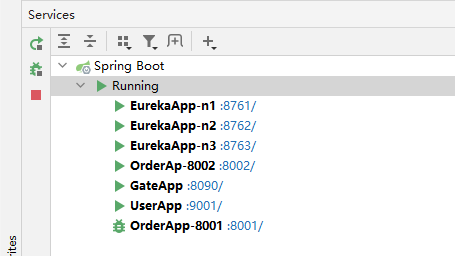

# spring-cloud-zuul-loadbalance

## 介绍
spring-cloud zuulgateway+eureka 的loadbalance测试

### 模块说明
lr-eureka   eureka模块
lr-gate     zuul-gateway
lr-order    order-service
lr-user     user-service 其会通过gateway访问order-service的接口

## eureka集群
单机上部署eureka集群时需要注意，需要配置eureka.instance.prefer-ip-address=false,并且配置eureka.instance.hostname，eureka.client.service-url.defaultZone也需使用hostname.
因为2个原因：
  1.在获取eureka启动后resolvePeerUrls时会遍历defaultZone的url,如果url和本实例serviceUrl hostname相同，则移除(本意是本实例不放到replicaUrls)
  2.在获取replicaUrls状态时，遍历url是否和eureka某个instance的serviceUrl hostname相同，相同才会加到available-replicas中。


## 负载均衡验证

+ order-service设计
在order-service的orderOfUser接口中，我们假设只有当服务端口和访问的userid一致时才能访问，否则抛出RuntimeException，从而服务500.
  这样当多次访问8001时，如果服务路由到8002的服务将报错;同理访问8002时，如果服务路由到8001的服务将报错.
```java
@Slf4j
@RestController
@RequestMapping("/order")
public class OrderController {

    Map<Integer,List<OrderVo>> userOrderMap = new HashMap<>();

    @PostConstruct
    private void init(){
        userOrderMap.put(8001,new ArrayList<>());
        userOrderMap.put(8002,new ArrayList<>());

        userOrderMap.get(8001).add(new OrderVo(1,8001,"毕业",49));
        userOrderMap.get(8001).add(new OrderVo(2,8001,"谎言",39));
        userOrderMap.get(8001).add(new OrderVo(3,8001,"红手指",30));
        userOrderMap.get(8002).add(new OrderVo(4,2,"平凡的世界",60));
        userOrderMap.get(8002).add(new OrderVo(5,2,"人生",20));
    }

    @Value("${server.port}")
    private Integer port;

    @GetMapping(value = "/orderOfUser/{userid}")
    public List<OrderVo> orderOfUser(@PathVariable("userid")Integer userid) {
        log.info("orderOfUser.userid=" + userid);
        if(!port.equals(userid)){
            throw new RuntimeException("xxxxx: this server can only view port="+port);
        }
        return userOrderMap.get(userid);
    }

}

```  

## 运行步骤
1. 分别启动3个eureka，运行时profile分别为n1,n2,n3
2. 启动gateway
3. 启动2个OrderApp 运行参数分别为--server.port=8001和--server.port=8002

如图 
4. 测试
`http://localhost:8090/orderserver/order/orderOfUser/8001  #通过gateway访问order服务`
`http://localhost:9001/userserver/user/usrBook/8001 #访问userserver,内部通过gateway调用http://GATEWAYSVC/orderserver/order/orderOfUser/{userid}  负载均衡`
   
通过访问上述的url,当参数为8001，多试几次可能会发现8002的console日志报错，但响应不会报错，同理参数为8002时可能发现8001的console会报错。
因为配置了，gateway的retry参数，在发生500错误时到下一个服务器retry
```properties
ribbon.MaxAutoRetriesNextServer=1   #重试其他实例的最大重试次数，不包括首次所选的server
ribbon.MaxAutoRetries=0             #同一实例最大重试次数，不包括首次调用，
ribbon.retryableStatusCodes=500     #status=500时重试
```

